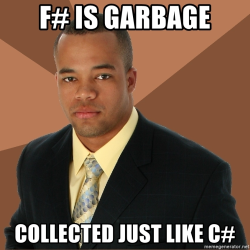

# F\#


## Checking the sample code

_(Contributed by [Djoums](https://www.codingame.com/profile/f0b5a892e52b5ec167931b7bdf52eb982136521)):_

```F# runnable
open System
open System.Text.RegularExpressions
(* Console.In.ReadLine().ToCharArray() *)
"CG".ToCharArray()
    |> Array.map (fun c -> Convert.ToString(int c, 2).PadLeft(7, '0'))
    |> String.Concat
    |> fun s -> Regex.Matches(s, "(.)\1*")
    |> Seq.map (fun m -> let s = m.ToString() in (if s.[0] = '1' then "0 " else "00 ") + (String.replicate s.Length "0"))
    |> String.concat " "
    |> printfn "%s"
```

## Looking at the syntax

- This is very different from an imperative style code! A proper introduction to _functional programming_ (FP) is unfortunately beyond the scope of this playground.
- Single line comments can be declared with `//`, but multi-line comments are between `(*` and `*)`. Don't ask...
- `|>` is the pipe forward operator, used to chain the function calls. Each call receives the result of the previous one as a parameter.
- There are some function names (`Convert.ToString` and `PadLeft`) which look exactly the same as in our _C#_ solution. This is not a coincidence. As _C#_, _F#_ and _VB .NET_ are all targeting Microsoft's _Common Language Infrastructure (CLI)_ on _.NET Core_, they share some of the standard libraries.
- Unlike the `using` statement in C#, F# uses `open`. This comes from a design choice of organizing functions in `modules` rather than `namespaces`.
- `fun x ->` defines an anonymous lambda function on the fly.
- `if`..`then`..`else` is not a conditional statement, but a conditional expression so it returns a result.
- `in` is equivalent to a new line after a `let`, allowing you to write several instructions in one go.

## Other characteristics

Collections are usually very important in F#, here are some points worth noting:

- `Lists` in F# are very different from their C# counterpart. They are immutable singly-linked lists designed for enumeration, but _not_ for direct indexing (you can, but performance will be horrendous).
- `Arrays` are your usual fixed-size contiguous-memory fast access collections. They are not immutable however. Note that we used an array map call in our example with `Array.map`.
- `Sequences` are an abstraction that represents a collection, which doesn't care about how the collection is implemented under the hood. They are also _Lazy_, making them very similar to `IEnumerable` in C#. We also used a map call on a sequence in our example, but this time it was with `Seq.map`.
- You can of course create your own collections.

_F#_ defines itself as "_functional-**first**_" programming language. Unlike _Haskell_, which is pure uncompromising FP, with _F#_ you can mix in some imperative or object-oriented style in your code, when it makes sense.
However, this can be abused. To demonstrate, let us look at an F# `Chuck Norris` solution in imperative style. **Don't try this at home!** :-)

```F# runnable
open System
(* let m = Console.In.ReadLine() *)
let m = "CG"
let c = [| "00"; "0" |]
let mutable b = ""
for ch in m do
    b <- b + Convert.ToString(ch |> int, 2).PadLeft(7, '0')
let mutable a = ""
a <- a + c.[(b.[0] |> int) - ('0' |> int)] + " 0"
for i = 1 to (String.length b) - 1 do
    if b.[i] = b.[i - 1] then
        a <- a + "0"
    else
        a <- a + " " + c.[(b.[i] |> int) - ('0' |> int)] + " 0"
(* eprintfn "Debug message" *)
printfn "%s" a
```

## Resources to check

- [Overview on Wikipedia](https://en.wikipedia.org/wiki/F_Sharp_(programming_language))
- [Official tutorial](https://fsharp.org/learn/index.html)



## Coming next...

The natural choice for the next section is the _"most-FP language of all FP languages"_, **Haskell**...
