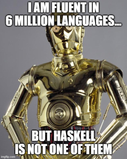
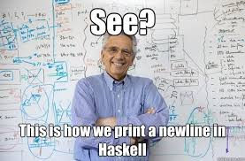

# Haskell


Unfortunately, this section is not ready yet, as I lack the necessary skills in Haskell... _(Volunteer contributors are welcome!)_



## Checking the sample code

_Well, I managed to make the puzzle work, but it is most likely a rather inferior Haskell code..._

```haskell runnable
import System.IO
import Control.Monad
import Data.Char
import Numeric

pad0 :: Int -> String -> String
pad0 n x = take (n - length x) (cycle "0") ++ x

nextStr c curr prev = if curr == prev
    then "0"
    else " " ++ c !! (ord curr - ord '0') ++ " 0"

main :: IO ()
main = do
    hSetBuffering stdout NoBuffering -- DO NOT REMOVE
    m <- getLine
    let c = ["00", "0"]
    let b = concatMap (\x -> pad0 7 $ showIntAtBase 2 intToDigit (ord x) "") m
    hPrint stderr m
    hPrint stderr b
    let start = c !! (ord (head b) - ord '0') ++ " 0"
    let z = zip (tail b) b
    let ansRest = concatMap (uncurry (nextStr c)) z
    let ans = start ++ ansRest
    putStrLn ans
    return ()
-- hPutStrLn stderr "Debug messages..."
```

## Looking at the syntax

- TODO

## Other characteristics

- TODO

## Resources to check

- [Overview on Wikipedia](https://en.wikipedia.org/wiki/Haskell_(programming_language))
- [Official site](https://www.haskell.org/)
- [Learn You a Haskell - tutorial](http://learnyouahaskell.com/introduction)



## Coming next...

Before we move on to some more serious matters, let's focus on a language, which saw an enormous growth in popularity in the past 5+ years: **Python**!
