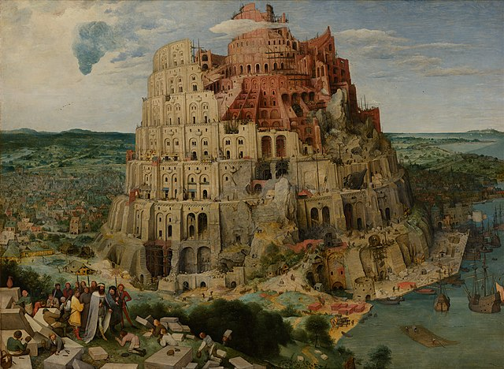
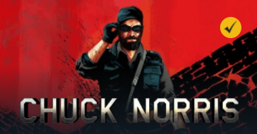

# A Babel of Languages on CodinGame

**Note: THIS IS STILL WORK IN PROGRESS! - Feedbacks and contributions welcome!**

**CodinGame** currently supports [**27** different programming languages](https://www.codingame.com/faq).
This provides us an excellent opportunity to leave the comfort zone of the language we regularly use, and to check out some new stuff!
This `tech.io` playground will explore some of the basic characteristics of these programming languages.

We will do this by examining a simple code snippet - the sample solution for the very same puzzle in each language.

The discussion assumes that you are already familiar with basic coding concepts, so you shall continue reading only if you already know to some extent at least one programming language. The playground is not meant as full-fledged language tutorials, we can really just scratch the surface in such short time. If you get interested in any of the languages, some links are provided for further study.

~~Screenshot from Sid Meier's Civilization VII~~ _The Tower of Babel by Pieter Bruegel the Elder (1563)_

## The sample puzzle

Throughout this article, I use the easy practice puzzle '[Chuck Norris](https://www.codingame.com/training/easy/chuck-norris)', as the example code. It is short, but already includes multiple language constructs. The sample solutions shown are not the best, shortest, or fastest code possible, they serve just as a common starting point for comparing the languages.

If you haven't solved this puzzle yet, _I highly recommend_ to **try to solve it** in your favourite coding language, **before** continuing reading this article! I will not discuss the puzzle itself, or how the solution works. The focus will be solely the diversity of the programming languages. While technicaly you can copy the sample solutions to the puzzle IDE for a quick success of submit, but you will miss the learning opportunity by doing so!

_Note: In order the code snippets remain runable in the playground, I commented out the line that reads input from the standard stream, and replaced it with a constant input. For the real puzzle, of course you will need to read the input for the test cases._

## Languages covered

**I recommend to go through the playground pages in order**, because the language under consideration is compared to the languages discussed earlier, so only the differences are highlighted. The order is somewhat arbitral, but I did some grouping to make the discussion a bit easier to follow.

If you insist, you can still jump to a specific part of the playground by using the direct links at the header row.

- Sections ready: _C#_, _Java_, _PHP_, _JavaScript_, _F#_, _Python_
- Sections with code snippets but without textual description: _C++_, _C_, _Rust_, _Dart_, _Go_, _Perl_, _Ruby_, _Scala_, _VB .NET_
- Still on the _TODO_ list: _Haskell_, _Bash_, _Groovy_, _Kotlin_, _Swift_,
- While the following languages are supported on `CodinGame`, we cannot run code on `tech.io`: _Clojure_, _D_, _Lua_, _Objective-C_, _OCaml_, _Pascal_, _TypeScript_

**Note:** My ambition was a bit larger than my actual knowledge of most of the languages. If you are interested in showing your favourite language’s main features to other coders, **I would be glad to have You as a co-author / contributor!**
- Many thanks to [Djoums](https://www.codingame.com/profile/f0b5a892e52b5ec167931b7bdf52eb982136521), who contributed several sections to this project!

## Let's get started!
