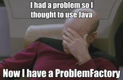

# Java


When C# was introduced in the early 2000s, it was accused of being "_just an imitation of Java_". (Java is 5 years older than C#.) The two languages diverged much more since that time, but the similarities are still quite obvious. Therefore, this section will be much shorter than the previous one.

## Checking the sample code

```java runnable
import java.util.*;

public class Main {

    public static void main(String args[]) {
        // Scanner in = new Scanner(System.in);
        // String m = in.nextLine();
        String m = "CG";
        String[] c = {"00", "0"};
        StringBuilder b = new StringBuilder();
        for (char w : m.toCharArray())
            b.append(String.format("%1$" + 7 + "s", Integer.toBinaryString((int)w)).replace(' ', '0'));
        StringBuilder a = new StringBuilder();
        a.append(c[b.charAt(0) - '0'] + " 0");
        for (int i = 1; i < b.length(); i++)
            if (b.charAt(i) == b.charAt(i - 1))
                a.append("0");
            else
                a.append(" " + c[b.charAt(i) - '0'] + " 0");
        // System.err.println("Debug messages...");
        System.out.println(a.toString());
    }
}
```

## Looking at the syntax

We can see similar features as in the C# sample solution, like:

- _classes_, a _static method_ as main, a strong and _static type system_, _arrays_, _type casting_, _iterators_, _loops_, _conditionals_, etc. The syntax is slightly different, but I will not go into detail for these features.

Some differences:

- _Java_'s `String` is _immutable_, so `StringBuilder` class is used to append characters to the solution character by character. It is converted to a string only at the last step by calling its `toString()` method.
- In _C#_, even the primitive types are objects. _Java_ features wrapper classes for the same role. (e.g. `Integer` for `int`).
- Of course, there are [many more differences](https://en.wikipedia.org/wiki/Comparison_of_C_Sharp_and_Java), which are not visible from such a short sample code, and are beyond the scope of this short introductory article.

## Other characteristics

- Both _Java_ and _C#_ are '_managed_' languages. _Java_ compiles to _Java bytecode_, which is then run on a JVM (_Java Virtual Machine_). Later on, we will see some other languages relying on the same JVM as its runtime environment.
- By using _JIT_, their speeds fall in the same range.
- _Java_ is very popular in the enterprise application development, due to its "_write once, run anywhere_" philosophy.
- Besides its _Standard Edition (SE)_, Java has additional editions, such as _Enterprise Edition (Java EE)_ which provides additional facilities for developing and running large, multi-tiered, reliable, and secure enterprise applications. Interestingly, in the past few years Java EE has lost some grounds, because cloud-native or microservice-based applications are more written in plain Java, using other frameworks such as _Spring_.

## Resources to check

- [Overview on Wikipedia](https://en.wikipedia.org/wiki/Java_(programming_language))
- [Official documentation at Oracle](https://docs.oracle.com/en/java/)
- [w3schools tutorial](https://www.w3schools.com/java/)



## Coming next...

After checking 2 compiled, managed languages with a strong type system, let's explore some languages with a very different approach: weakly typed and interpreted! We start by looking at **PHP**!
