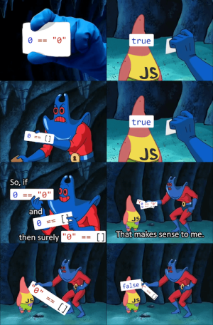

# JavaScript


_(This page is contributed by [Djoums](https://www.codingame.com/profile/f0b5a892e52b5ec167931b7bdf52eb982136521))_

## Checking the sample code

``` javascript runnable
//const m = readline();
const m = 'CG', c = ['00', '0'];
let b = '';
for (const w of m)
    b += w.charCodeAt(0).toString(2).padStart(7, '0');

let a = c[b.charCodeAt(0) - '0'.charCodeAt(0)] + ' 0';
for (let i = 1; i < b.length; i++) {
    if (b[i] === b[i - 1])
        a += '0';
    else
        a += ' ' + c[b[i].charCodeAt(0) - '0'.charCodeAt(0)] + ' 0';
}
// console.error('Debug messages...');
console.log(a);
```

## Looking at the syntax

Let's check the above code for some characteristics of javascript (JS) syntax:

- `//...` Here we commented out the reading from input stream, and replaced it with a simple assignment.
- `const m = 'CG'`
  + JS is an interpreted language with dynamically typed variables, which means we never give a type to any of our variables. Variables can even change their underlying type during the course of the program, although it is something you should always avoid, unless you have a very good reason to do so.
  + `const` means read-only and prevents `m` from being reassigned after its initialisation. It is generally a good practice to declare any variable with `const` whenever possible, as it can prevent bugs preemptively and help developers understand the flow of the code.
  + `'CG'` is a string but can also be declared as `"CG"`, as long as your choice of quote is consistent, JS will oblige.
- `c = ['00', '0'];`
  + Since `c` is declared on the same line as `m`, it also receives the `const` modifier.
  + `[ ]` indicates an array of elements, which in this case is an array containing two strings: `'00'` and `'0'`.
  + `;` at the end of a line is optional in JS and comes down to personal preference.
- `let b = '';`
  + Opposite to `const` is `let`, which is an indication that this variable is going to see some change in your program.
  + Note that `var` is also usable instead of `let`, but it is an older version of it that is supported as a legacy.
- `for (const w of m)`
  + A for-of loop allows you to iterate through a given iterable, in this case a string, which is an iterable of chars. You can of course do the same for an array.
  + Curly braces `{ }` are optional for single statement instructions.
- `b += Number(w.charCodeAt(0)).toString(2).padStart(7, '0');` Several things are happening in this line, so let's go one by one:
  + We can concatenate strings with the `+` operator. The `+` operator is overloaded by different types, meaning different operations will happen if the operands are strings or numbers for example.
  + `+=` is a shortcut for saying that b = b + somethingElse.
  + `w.charCodeAt(0)` is a function call that returns the ASCII code of the 0th character in a string, this code is a number.
  + `.toString(2)` is another function call, that can be used on numbers to display them as a string. The `2` is an optional parameter that indicates which base we want to display the number in, in this case 2 means as binary.
  + `.padStart(7, '0')` is yet another (final) function call, that can be used on a string. It means that we want our string to be at least 7 characters long, and if it is not, then fill it with `'0'` from the left until it is. For example `101100` would become `0101100`.
- `let a = c[b.charCodeAt(0) - '0'.charCodeAt(0)] + ' 0';` the only new thing in this line is referencing an array's elements using square brackets `[ ]`. Arrays are 0 indexed.
- `for (let i = 1; i < b.length; i++)` The typical C-style loop syntax. Since `b` is a string, we can access its length by calling its property `.length`.
- `if (b[i] === b[i - 1])`
  + A straightforward equality comparison, except it is actually not. For historical reasons, the traditional `==` (equality operator) should pretty much never be used in JS, and be replaced with `===` (identity operator). If you want to learn more about it, you can read a detailed explanation here: https://developer.mozilla.org/en-US/docs/Web/JavaScript/Reference/Operators
  + The ternary operator `? :` could have been also used here.
- `console.log(a);` Writing to the console. We will need this a lot on CodinGame! :-)

## Other characteristics

While not directly visible from the above code snippet, there are some other important aspects of JS worth noting :

- As an interpreted language, JS needs an engine to be executed. When navigating on the web, this is done by your browser, and since this is a major part of web pages now, all those engines have been very optimized. V8 is the most used engine, as all the chromium based browsers depend on it, as well as Node.js and the applications built with Electron.
- JS uses _garbage collection_, so you don't have to manually manage memory. In fact you can't, even if you wanted to, there's no syntax or keyword that would allow you to.
- JS has a single `Number` type, no int/float/double to be seen here, all the same! This format makes things simpler but has some drawbacks:
  + Numbers have a double-precision 64 bits representation, which is fine for many uses but will fail for some. In particular, the maximum exponent attainable for an integer value is 53 in this format, meaning that the maximum integer value for a JS number is `2^53 - 1`. Whereas formats like `long` in other languages can go up to `2^63 - 1`. This can easily cause trouble in CodinGame puzzles and is a limitation authors should keep in mind.
  + Numbers being 64 bits by default means you have no control over their memory consumption, there's no way to declare a 16 or 32 bits integer for example.
- JS can be very strong when it comes to functional programming. Functions are treated as any other objects, a principle often called _functions as first class citizens_.
- There are many advanced language features we cannot address in this intro, such as _interfaces_, _inheritance_, _delegates_, _currying_ etc.
- One of the infamous characteristics of JS is the complete freedom it gives to the developer. It is so flexible and accepting that you can write pretty much anything, from the awesome to the horrendous. To mitigate this issue and add consistency, TypeScript (TS) was created, as a superset of JS. It means your TS code is _transpiled_ into regular JS before running.
- _Generics_ are not supported in JS, however TS adds that feature.

## Embracing the functional freedom

Let's revisit our initial code to take advantage of both the freedom and the functional strength of JS.

``` javascript runnable
console.log('CG' // readline()
    .split('')
    .map(c => ('0' + c.charCodeAt(0).toString(2)).slice(-7))
    .join('')
    .match(/(.)\1*/g)
    .map(c => ['00 ','0 '][c[0]] + '0'.repeat(c.length))
    .join(' '));
```

As you can see, our code is now a one-liner! Albeit a long one :-)
We can do so by _chaining function calls_ and construct a single complex query, operation by operation. Let's analyze this new code.
- `.split('')` splits a string using the given argument as a separator. In this case it is empty, so the function will separate all characters of the string and return an array of chars.
- `.map(c => ('0' + c.charCodeAt(0).toString(2)).slice(-7))`
  + `map` is a tranformative function, it is called on a array and returns another array. It takes a function as a parameter, which will be applied to every element of the initial array, in order to create the resulting array. For example if you had `[1, 2, 3]` and you called `.map(i => i + 1)` on it, you would get `[2, 3, 4]` as the output. Note that the output is a _new array_, leaving the original untouched.
  + `.map(c => ...)` makes use of _lambda functions_, which are inlined anonymous functions. You can create a regular function and pass it as an argument to the `map` call, but in this case we simply declare it on the fly.
  + `'0' + c.charCodeAt(0).toString(2)` has been covered in the initial code, nothing new here.
  + `.slice(-7)` is a neat trick. `slice` is a function that returns a subrange from an array or a string, by giving it a starting index and an ending index (optional). By using `-7` as the starting index, we're telling the program to take the last 7 characters. Combined with the added `'0'` in front of `c.charCodeAt(0).toString(2)`, this replaces the call to `.padStart` that we used initially. It isn't better or worse per se, simply different for demonstration purposes.
- `.join('')` can be called on an array to create a string representation of it, using the parameter as an element separator. In this case it is empty, so all the elements will be concatenated directly. The elements are converted into strings themselves in the process, by calling the default `.toString()` function on each one.
- `match(/(.)\1*/g)` is the most complex line here.
  + This is a call to a _regular expression_, which is a powerful tool to parse/analyze strings. Powerful but intimidating, because of its very specific syntax and potential complexity. If you want to learn more, you can look at the following guide: https://developer.mozilla.org/en-US/docs/Web/JavaScript/Guide/Regular_Expressions
  + Without going into to much details, this regular expression will split a given string into chunks of the same value, for example the string `10001100` would become `['1', '000', '11', '00']`.
- `.map(c => ['00 ','0 '][c[0]] + '0'.repeat(c.length))` : another transformative call
  + `['00 ','0 '][c[0]]` is a small example of the freedom of JS. Here `c[0]` is a string, yet we directly use it to access an array by index. No worries, JS will recognize at runtime that it should be a number and interpret the string as such (if it is not a number, bad things can ensue :-)).
  + `'0'.repeat(c.length)` is straightforward, repeat `'0'` by the given count and make a string as a result.
- `.join(' ')` our final call. We saw this one earlier but this time we're asking for a space to be inserted between each element of the array.

## Resources to check

- [Overview on Wikipedia](https://en.wikipedia.org/wiki/JavaScript)
- [Javascript guide](https://developer.mozilla.org/en-US/docs/Web/JavaScript/Guide)
- [w3schools tutorial](https://www.w3schools.com/js/)



## Coming next...

In the above Javascript article we have already seen some functional programming in action. Let's dive into this subject even deeper, and visit **F#**!
