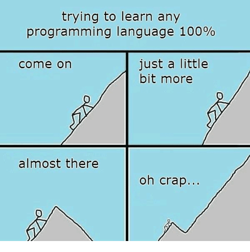

# Conclusion

It was a long ride!\
I hope you liked it, and also learned something new along the road.
Thank you for your time!

## Where to go next?

- Solve some [solo puzzles](https://www.codingame.com/training) in a new language!
- Do some [Clash of Code](https://www.codingame.com/multiplayer/clashofcode) in a new language! Surely, you will loose many games in the beginning, but the best way of learning is by doing!
- Write a bot for a [multiplayer AI game](https://www.codingame.com/multiplayer/bot-programming)!
- Join [CG Discord channel](https://discord.com/channels/466965651135922206/466965651135922208) or [CG Forum](https://www.codingame.com/forum/t/languages-update/1574) and harass all Codingamers and the CG staff by insisting to add support for _language X_! :smiley:
- Give me some feedback or pull request on how to improve this `tech.io` playground! (Its source is available on [github](https://github.com/tbali0524/playground-dvtfkqgd).)

_(Source: unknown)_

## Bye!
